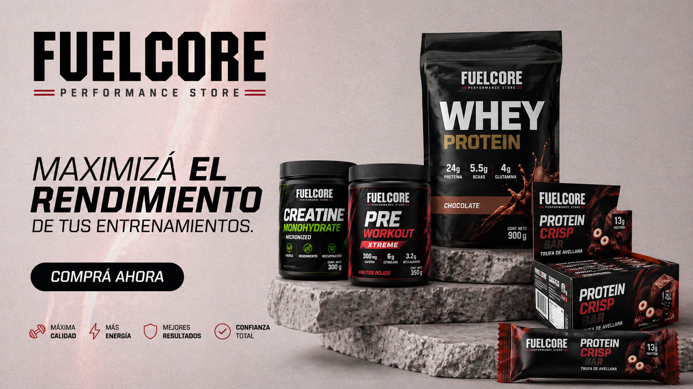

# FuelCore

FuelCore es una tienda online full stack de suplementos y fitness pensada con una lectura comercial real: catalogo, cuenta de usuario, carrito, checkout con Mercado Pago y panel administrativo sobre una misma base.

## Vista previa



Demo online:

- Frontend: [fuelcore-drab.vercel.app](https://fuelcore-drab.vercel.app)
- API: [fuelcore.onrender.com/api/health](https://fuelcore.onrender.com/api/health)
- Repositorio: [github.com/LucasPatricioRey/fuelcore](https://github.com/LucasPatricioRey/fuelcore)

## Que incluye

- catalogo visual de suplementos con filtros y detalle individual
- autenticacion con JWT y roles
- carrito persistente
- checkout integrado con Mercado Pago Checkout Pro
- historial de ordenes por usuario
- dashboard admin con metricas y gestion operativa

## Stack

### Frontend

- Vue 3
- Vue Router
- Pinia
- Vite

### Backend

- Node.js
- Express
- MongoDB
- Mongoose
- JWT
- Mercado Pago

## Estructura

```txt
fuelcore/
  client/   frontend en Vue 3
  server/   API REST en Express + MongoDB
```

## Flujo principal de compra

1. El usuario explora productos y agrega items al carrito.
2. El frontend envia items y direccion al backend.
3. El backend valida stock, precios y crea la orden pendiente.
4. Se genera la preferencia de pago de Mercado Pago.
5. El usuario completa el pago en Checkout Pro.
6. El webhook actualiza la orden y descuenta stock.
7. La compra queda visible en la cuenta del cliente.

## Variables de entorno

### Frontend

```env
VITE_API_URL=https://fuelcore.onrender.com/api
```

### Backend

```env
CLIENT_URL=https://fuelcore-drab.vercel.app
MONGO_URI=...
JWT_SECRET=...
MP_ACCESS_TOKEN=...
MP_WEBHOOK_SECRET=...
MP_CURRENCY=ARS
```

## Instalacion local

### 1. Clonar el proyecto

```bash
git clone https://github.com/LucasPatricioRey/fuelcore.git
cd fuelcore
```

### 2. Instalar dependencias

```bash
cd client
npm install

cd ../server
npm install
```

### 3. Configurar entorno

Crear:

- `client/.env`
- `server/.env`

Usando los valores de la seccion anterior.

### 4. Levantar el proyecto

Frontend:

```bash
cd client
npm run dev
```

Backend:

```bash
cd server
npm run dev
```

## Seed inicial

El backend incluye una semilla basica para poblar productos y un admin inicial.

```bash
cd server
npm run seed
```

Credenciales admin de semilla:

- email: `admin@fuelcore.com`
- password: `Admin1234`

## Deploy

### Frontend en Vercel

- Root Directory: `client`
- Framework Preset: `Vite`
- Variable requerida: `VITE_API_URL`

### Backend en Render

El proyecto incluye [render.yaml](./render.yaml) para facilitar la configuracion.

- Root Directory: `server`
- Build Command: `npm install`
- Start Command: `npm start`
- Health Check Path: `/api/health`

## Estado actual

Hoy el proyecto ya cubre:

- storefront visual completo con home, catalogo, detalle, carrito y checkout
- cuenta de usuario con historial de compras
- panel admin funcional
- deploy activo de frontend y backend
- identidad visual unificada para la experiencia de compra

## Mejoras futuras posibles

- ABM completo de productos desde admin
- cupones y promociones reales
- carga y edicion de banners desde admin
- busqueda mas avanzada
- resenas y prueba social
- optimizacion de media y performance

## Autor

Desarrollado por [Lucas Patricio Rey](https://github.com/LucasPatricioRey).
